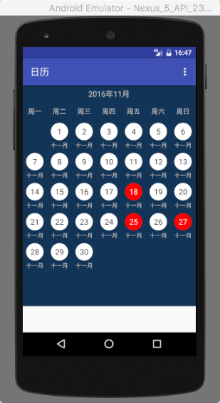
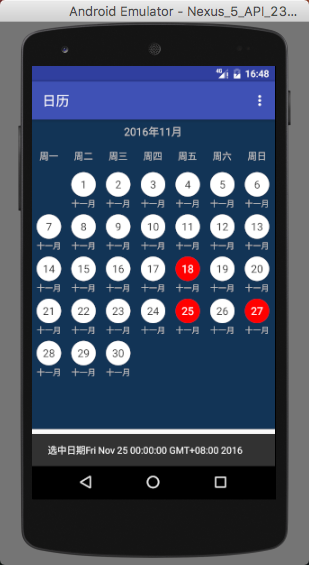
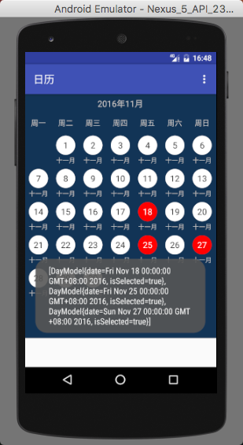
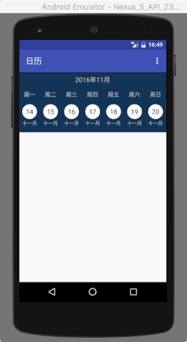

CustomWidget for Android
==========================
>These are some simple Custom Widget for Android;


Include:[CustomCalendar](#calendar)


##<span id="calendar">CustomCalender</span>







Usage
-----

Include `CustomCalender` in your layout XML.

```xml
 <com.jekyll.wu.widget.calendar.widget.CustomCalendar
        android:id="@+id/calendar"
        android:layout_width="match_parent"
        android:layout_height="wrap_content"
        />
```
```java
    CustomCalendar customCalendar = (CustomCalendar) view.findViewById(R.id.cc_test);
    customCalendar.setDateFormat(new SimpleDateFormat("yyyy-MM", Locale.getDefault()));
    Calendar start = Calendar.getInstance();
    DateFormat format = new SimpleDateFormat("yyyyMMdd", Locale.getDefault());
    Date startDate = format.parse("20151001");
    start.setTime(startDate);
    Calendar end = Calendar.getInstance();
    models = new LinkedList<>();
    models = customCalendar.setCalendarRange(start, end);//设置日期的开始结束位置
    customCalendar.setPagerModels(getChildFragmentManager(), models);
    customCalendar.setCurrentWeek(models.size() - 1);//设置日期到最后一页

```

This is two styles for calendar view,you can set it by follow code;

```java
    customCalendar.setCalendarStyle(CustomCalendar.WEEK_STYLE);//一页只显示一周
    customCalendar.setCalendarStyle(CustomCalendar.MONTH_STYLE);//一页显示一月
```

If you want OnClick event for each DayView,just implement OnDateCheckedListener on Activity of Fragment.

```java
public class CalendarFragment extends Fragment implements OnDateCheckedListener {
    @Override
    public void onDateClicked(View view, DayModel day) {

    }
}

public class MainActivity extends AppCompatActivity implements OnDateCheckedListener {
    @Override
        public void onDateClicked(View view, DayModel day) {

    }
}
```


Download
--------

The latest version can be downloaded in [zip][zip] and referenced by your application as a library
project.

You can also depend on the library through Maven:
```xml
<dependency>
  <groupId>com.jekyll.wu.widget</groupId>
  <artifactId>calendar</artifactId>
  <version>1.1.1</version>
  <type>pom</type>
</dependency>
```
or Gradle:
```groovy
compile 'com.jekyll.wu.widget:calendar:1.1.1'
```

Snapshots of the development version are available in [Sonatype's `snapshots` repository][snap].


License
-------

    Copyright 2012 Square, Inc.

    Licensed under the Apache License, Version 2.0 (the "License");
    you may not use this file except in compliance with the License.
    You may obtain a copy of the License at

       http://www.apache.org/licenses/LICENSE-2.0

    Unless required by applicable law or agreed to in writing, software
    distributed under the License is distributed on an "AS IS" BASIS,
    WITHOUT WARRANTIES OR CONDITIONS OF ANY KIND, either express or implied.
    See the License for the specific language governing permissions and
    limitations under the License.


 [zip]: https://github.com/JieJacket/CustomWidget/archive/master.zip


